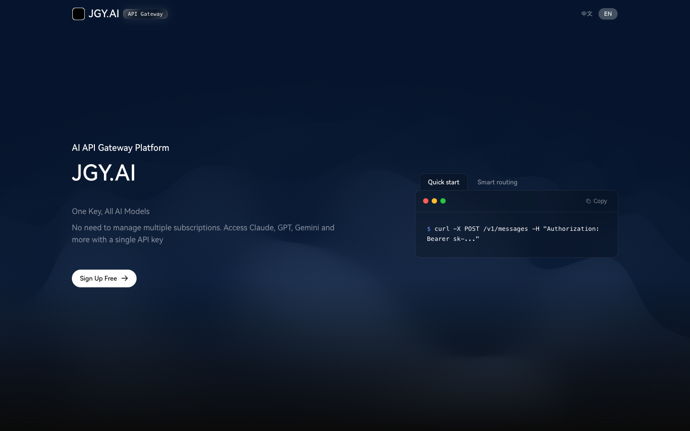

# Sub2Dsh

JGY.AI 的独立深色 Vue 3 主页，包含 WebGL 波浪、等高线动效、双语切换和响应式布局。项目不依赖后端 API，可直接构建并部署为静态站点。

JGY.AI's standalone dark Vue 3 homepage with WebGL waves, topographic motion, bilingual copy, and responsive layouts. It has no backend dependency and can be built and deployed as a static site.

[在线预览 / Live Demo](https://yigehaozi.github.io/sub2-dsh/) · [源仓库 / Repository](https://github.com/yigehaozi/sub2-dsh)



## 功能 Features

- 可配置品牌名称、副标题、Logo、主 CTA 和文档入口。
- 支持中文 / English 切换，并持久化访客选择。
- 使用 GradientWaves WebGL2 首屏和 OGL Topography CTA 动效。
- 在 WebGL、IntersectionObserver 不可用或启用 reduced-motion 时自动降级。
- 提供代码示例标签、复制反馈、工作流交互和桌面滚动联动。
- 页面页脚固定保留 [源仓库链接](https://github.com/yigehaozi/sub2-dsh)。

## 运行与构建

需要 Node.js 20+。项目通过 `packageManager` 固定使用 pnpm 9.15.9。

```bash
corepack enable
pnpm install --frozen-lockfile
pnpm dev
```

本地检查与构建：

```bash
pnpm typecheck
pnpm test:run
pnpm build
```

## 配置 Configuration

复制 `.env.example`，然后按需设置以下构建变量：

| 变量 | 默认值 | 说明 |
| --- | --- | --- |
| `VITE_SITE_NAME` | `JGY.AI` | 页面品牌名称 |
| `VITE_SITE_SUBTITLE` | `AI API Gateway Platform` | 首屏副标题 |
| `VITE_SITE_LOGO` | 当前 base 下的 `logo.png` | 自定义值仅接受绝对 HTTP/HTTPS URL |
| `VITE_PRIMARY_CTA_URL` | `https://jgy.ai/login` | 主 CTA 地址；非法值回退到默认地址 |
| `VITE_DOCS_URL` | 空 | 文档地址；为空或非法时隐藏文档入口 |
| `VITE_BASE_PATH` | `/` | 部署子路径；GitHub Pages 使用 `/sub2-dsh/` |

主 CTA、文档和自定义 Logo 地址必须使用绝对 `http://` 或 `https://` URL。源仓库地址是固定归属信息，不支持通过环境变量替换。

## GitHub Pages

推送到 `main` 后，[Pages 工作流](.github/workflows/pages.yml) 会执行以下流程：

1. 使用 Node.js 20 和 pnpm 9.15.9 安装依赖。
2. 运行类型检查和单元测试。
3. 以 `VITE_BASE_PATH=/sub2-dsh/` 构建静态文件。
4. 将 `dist` 部署到 GitHub Pages。

仓库的 Pages 发布源需设置为 **GitHub Actions**。部署地址：<https://yigehaozi.github.io/sub2-dsh/>

本项目不发布 npm 包，GitHub Packages 保持为空。

## 归属与许可证 Attribution & License

再分发或制作衍生主页时，必须保留：

- 根目录的 `NOTICE` 文件。
- 源仓库地址：<https://github.com/yigehaozi/sub2-dsh>
- 部署页面页脚中可见的源仓库链接。

本项目使用 `LGPL-3.0-or-later`。完整条款见 [LICENSE](LICENSE)，附加归属要求见 [NOTICE](NOTICE)，第三方依赖和字体声明见 [THIRD_PARTY_NOTICES.md](THIRD_PARTY_NOTICES.md)。
